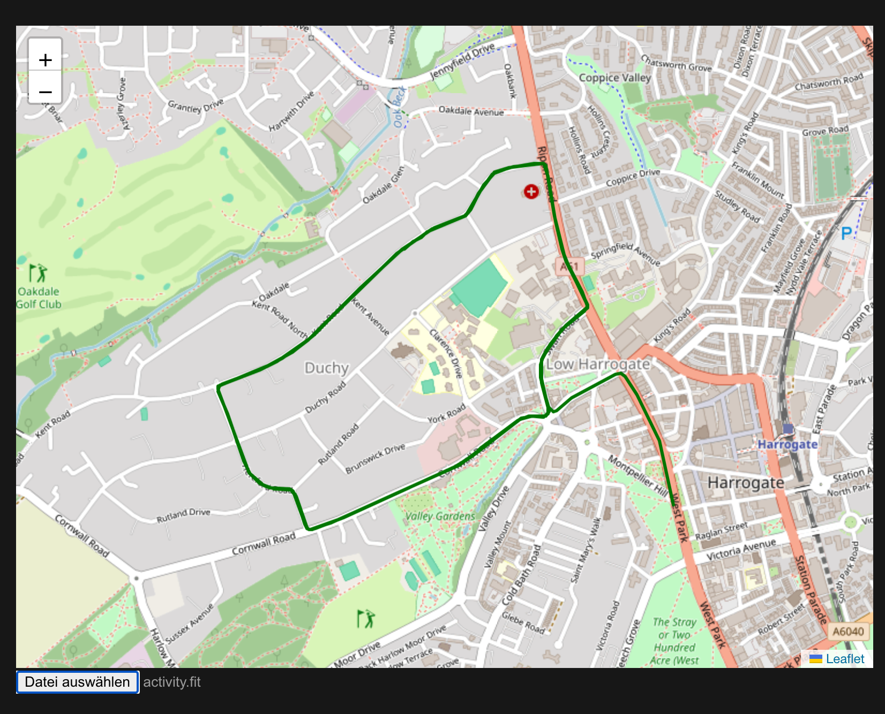

# Fit Map

Fit Map is a small PoC in Vue to select a Garmin activity .fit file and show the route on a map.

## Requirements

- npm
- A garmin fit file

## Setup

1. Clone this repo
2. Run `npm install`
3. Run `npm run dev`

## Usage

You should see a local address after running `npm run dev` in your console output. Open this address in your browser to use the application.